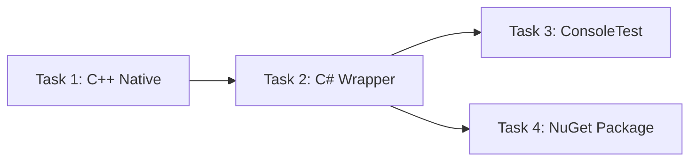

# Task Board - TqkLibrary.AudioCapture

## Thứ tự thực hiện

> **Ghi chú**: Task 1 phải hoàn thành trước Task 2. Task 3 và Task 4 có thể song song sau Task 2.

---

## Trạng thái tổng quan

| # | Task | File chi tiết | Trạng thái | Ưu tiên |
|---|------|---------------|------------|---------|
| 1 | C++ Native DLL (WASAPI) | [01_Task_NativeCpp.md](01_Task_NativeCpp.md) | ⬜ Chưa bắt đầu | 🔴 Cao |
| 2 | C# Managed Wrapper | [02_Task_CSharpWrapper.md](02_Task_CSharpWrapper.md) | ⬜ Chưa bắt đầu | 🔴 Cao |
| 3 | ConsoleTest App | [03_Task_ConsoleTest.md](03_Task_ConsoleTest.md) | ⬜ Chưa bắt đầu | 🟡 Trung bình |
| 4 | NuGet Package & Script | [04_Task_NuGetPackage.md](04_Task_NuGetPackage.md) | ⬜ Chưa bắt đầu | 🟡 Trung bình |

---

## Chi tiết Subtasks

### Task 1: C++ Native DLL
| # | Subtask | Trạng thái |
|---|---------|------------|
| 1.1 | Setup headers và COM | ⬜ |
| 1.2 | Enum Audio Endpoints | ⬜ |
| 1.3 | Enum Audio Sessions | ⬜ |
| 1.4 | Audio Capture (Endpoint) | ⬜ |
| 1.5 | Process Audio Capture | ⬜ |
| 1.6 | Error Handling | ⬜ |

### Task 2: C# Managed Wrapper
| # | Subtask | Trạng thái |
|---|---------|------------|
| 2.1 | Cập nhật BaseAudioNative | ⬜ |
| 2.2 | Data Models | ⬜ |
| 2.3 | Interfaces | ⬜ |
| 2.4 | P/Invoke Declarations | ⬜ |
| 2.5 | AudioCaptureStream | ⬜ |
| 2.6 | AudioCapture Entry Point | ⬜ |
| 2.7 | Cleanup code cũ | ⬜ |

### Task 3: ConsoleTest
| # | Subtask | Trạng thái |
|---|---------|------------|
| 3.1 | Test liệt kê Endpoints | ⬜ |
| 3.2 | Test liệt kê Sessions | ⬜ |
| 3.3 | Test Capture Endpoint | ⬜ |
| 3.4 | Test Capture Process | ⬜ |
| 3.5 | Menu tương tác | ⬜ |

### Task 4: NuGet Package
| # | Subtask | Trạng thái |
|---|---------|------------|
| 4.1 | Tạo `.nuspec` | ⬜ |
| 4.2 | MSBuild targets | ⬜ |
| 4.3 | Script `Pack.ps1` | ⬜ |

---

## Ước lượng thời gian

| Task | Ước lượng |
|------|-----------|
| Task 1: C++ Native | ~4-6 giờ |
| Task 2: C# Wrapper | ~3-4 giờ |
| Task 3: ConsoleTest | ~1-2 giờ |
| Task 4: NuGet Pack  | ~1-2 giờ |
| **Tổng** | **~9-14 giờ** |

---

## Rủi ro & Lưu ý

| Rủi ro | Giải pháp |
|--------|-----------|
| Process loopback capture cần Windows 10 2004+ | Fallback: chỉ hỗ trợ endpoint capture trên Windows cũ |
| COM threading model conflicts | Sử dụng `CoInitializeEx(COINIT_MULTITHREADED)` |
| Audio format không phải PCM (compressed) | WASAPI shared mode luôn trả về PCM float hoặc PCM int |
| Native DLL crash ảnh hưởng managed process | Kỹ catch HRESULT errors trong C++, trả NULL/false |
